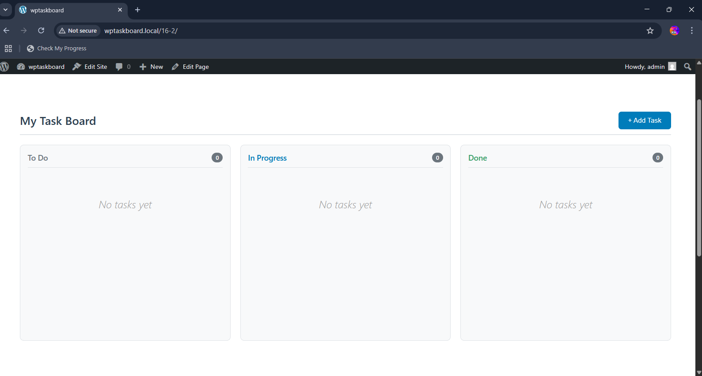
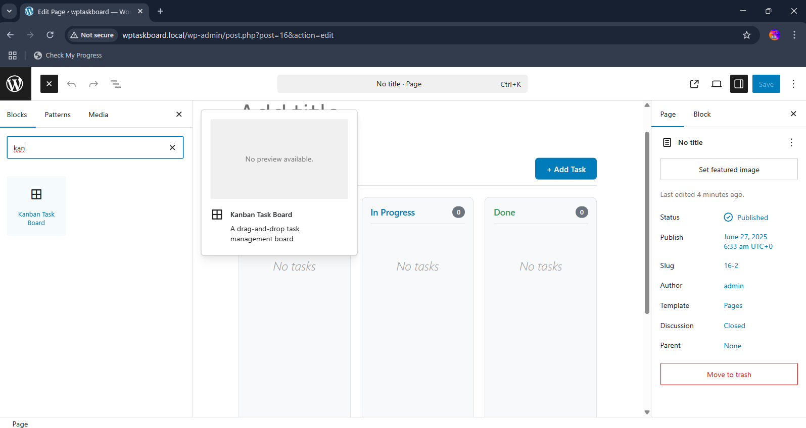
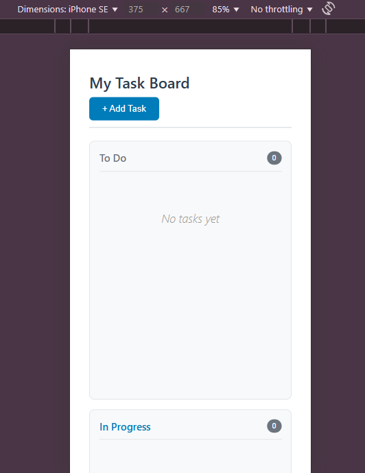

# WPTaskBoard - WordPress Kanban Task Management Plugin

A modern, full-featured Kanban task management plugin for WordPress with Gutenberg block integration. Create beautiful, interactive task boards directly in your WordPress posts and pages with drag-and-drop functionality.


## 📸 Screenshots

### Kanban Board in Action
*Screenshot of the main kanban board*



### Gutenberg Block Editor
*Screenshot showing the block in the WordPress editor*




### Mobile Responsive Design
*Screenshot showing mobile layout*



## ✨ Features

### 🎯 Core Functionality
- **Drag & Drop Interface** - Intuitive task movement between columns
- **Three-Column Layout** - To Do, In Progress, and Done columns
- **Real-time Updates** - AJAX-powered task management
- **Gutenberg Integration** - Native WordPress block editor support
- **Responsive Design** - Works perfectly on all devices

### 🛠️ Task Management
- **Quick Task Creation** - Add tasks with title, description, priority, and assignee
- **Priority Levels** - Visual priority indicators (High, Medium, Low)
- **Task Assignment** - Assign tasks to team members
- **Status Tracking** - Automatic status updates when moving tasks
- **Task Counting** - Real-time task count per column

### 🎨 Customization
- **Custom Board Titles** - Personalize your task boards
- **Toggle Add Button** - Show/hide the add task button
- **Modern UI** - Clean, professional design
- **Custom Styling** - Easy to customize with CSS

### 🔧 Technical Features
- **AJAX Integration** - Smooth, no-reload interactions
- **Database Storage** - Persistent task storage
- **REST API Ready** - Extensible API endpoints
- **Security First** - Nonce verification and data sanitization
- **Debug Support** - Built-in debugging and logging

## 🚀 Installation

### Method 1: Manual Installation
1. Download the plugin files
2. Upload the `wptaskboard` folder to `/wp-content/plugins/`
3. Activate the plugin through the 'Plugins' menu in WordPress
4. Start using the Kanban Board block in your posts/pages!

### Method 2: GitHub Installation
```bash
cd wp-content/plugins/
git clone https://github.com/yourusername/wptaskboard.git
```

## 📁 Project Structure

```
wptaskboard/
├── wptaskboard.php              # Main plugin file
├── README.md                    # This file
├── assets/
│   ├── css/
│   │   └── kanban-board.css     # Main stylesheet
│   └── js/
│       └── kanban-board.js      # Frontend JavaScript
├── blocks/
│   └── kanban-board/
│       ├── block.json           # Block configuration
│       ├── index.js             # Block registration
│       ├── edit.js              # Block editor component
│       ├── save.js              # Block save component
│       └── style.css            # Block-specific styles
├── includes/
│   ├── class-ajax.php           # AJAX handlers
│   ├── class-blocks.php         # Block management
│   ├── class-database.php       # Database operations
│   └── class-api.php            # REST API endpoints
└── screenshots/                 # Plugin screenshots
    ├── kanban-board-main.png
    ├── block-editor.png
    └── mobile-view.png
```

## 🎮 Usage

### Adding a Kanban Board

1. **In Block Editor:**
    - Click the "+" button to add a new block
    - Search for "Kanban Task Board"
    - Insert the block into your post/page

2. **Customize Settings:**
    - Set a custom board title in the block settings
    - Toggle the "Add Task" button visibility
    - Adjust alignment (wide/full width supported)

### Managing Tasks

1. **Adding Tasks:**
    - Click the "+ Add Task" button
    - Fill in task details (title, description, priority, assignee)
    - Submit to add to the "To Do" column

2. **Moving Tasks:**
    - Drag tasks between columns to change status
    - Changes are automatically saved
    - Task counts update in real-time

## 🔧 Configuration

### Block Attributes

The Kanban Board block supports the following attributes:

```json
{
  "boardTitle": {
    "type": "string",
    "default": "My Task Board"
  },
  "showAddButton": {
    "type": "boolean", 
    "default": true
  }
}
```

### AJAX Endpoints

- `wptaskboard_add_task` - Create new tasks
- `wptaskboard_update_task` - Update task status/details

### CSS Classes

Key CSS classes for customization:

```css
.wptaskboard-kanban-board     /* Main container */
.kanban-board                 /* Board grid */
.kanban-column               /* Individual columns */
.kanban-task                 /* Task cards */
.priority-high/.priority-medium/.priority-low  /* Priority indicators */
```

## 🛠️ Development

### Requirements
- WordPress 5.0+
- PHP 7.4+
- Modern browser with JavaScript enabled

### Development Setup

1. Clone the repository
2. Set up a local WordPress development environment
3. Install the plugin in development mode
4. Enable WP_DEBUG for development logging

### File Structure Explained

- **Main Plugin File** (`wptaskboard.php`) - Plugin initialization and core functionality
- **Block Files** (`blocks/kanban-board/`) - Gutenberg block definition and editor interface
- **Assets** (`assets/`) - CSS and JavaScript files for frontend functionality
- **Includes** (`includes/`) - PHP classes for database, AJAX, and API functionality

### Hooks and Filters

The plugin provides several hooks for customization:

```php
// Example: Customize task creation
add_filter('wptaskboard_before_task_create', 'my_custom_task_handler');

// Example: Modify board output
add_filter('wptaskboard_board_html', 'my_custom_board_html');
```

## 🤝 Contributing

We welcome contributions! Here's how you can help:

1. **Fork the Repository**
2. **Create a Feature Branch** (`git checkout -b feature/amazing-feature`)
3. **Commit Changes** (`git commit -m 'Add amazing feature'`)
4. **Push to Branch** (`git push origin feature/amazing-feature`)
5. **Open Pull Request**

### Development Guidelines

- Follow WordPress coding standards
- Include PHPDoc comments for all functions
- Test on multiple WordPress versions
- Ensure mobile responsiveness
- Add appropriate error handling

## 🐛 Bug Reports & Feature Requests

Please use GitHub Issues to report bugs or request features:

1. **Bug Reports** - Include WordPress version, PHP version, and steps to reproduce
2. **Feature Requests** - Describe the feature and use case clearly
3. **Questions** - Use the Discussions tab for general questions

## 📋 Roadmap

### Version 1.1 (Planned)
- [ ] Task due dates and reminders
- [ ] User assignment with WordPress user integration
- [ ] Task templates and categories
- [ ] Export/import functionality

### Version 1.2 (Future)
- [ ] Multiple board support
- [ ] Task comments and attachments
- [ ] Advanced filtering and search
- [ ] Email notifications
- [ ] Integration with popular project management tools

### Version 2.0 (Long-term)
- [ ] Team collaboration features
- [ ] Advanced reporting and analytics
- [ ] Custom workflow states
- [ ] API webhooks
- [ ] Premium features and licensing

## 📝 Changelog

### Version 1.0.0 (Current)
- Initial release
- Gutenberg block integration
- Drag and drop functionality
- AJAX-powered task management
- Responsive design
- Basic task creation and management

## 📄 License

This project is licensed under the GPL v2 or later - see the [LICENSE](LICENSE) file for details.


## 🙏 Acknowledgments

- WordPress community for excellent documentation
- Gutenberg team for the block editor
- Contributors and beta testers
- Icons by [Dashicons](https://developer.wordpress.org/resource/dashicons/)


---

⭐ **If you find this plugin useful, please give it a star on GitHub!**

**Made with ❤️ for the WordPress community**